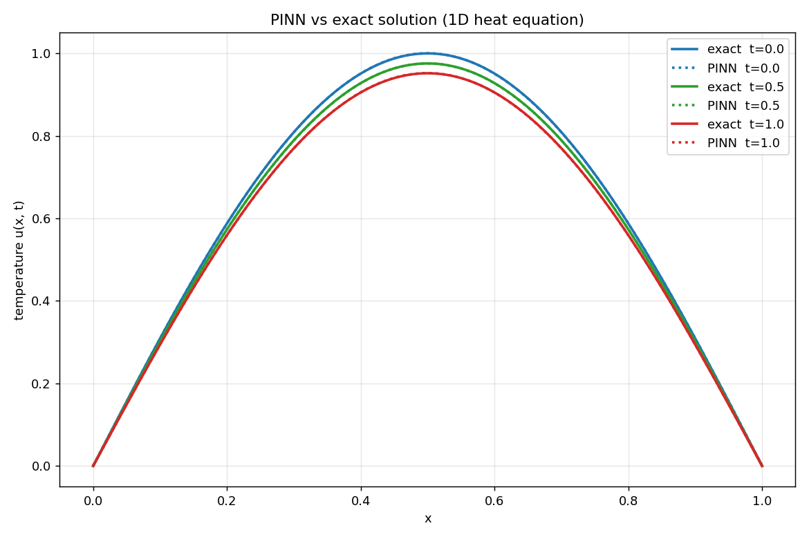
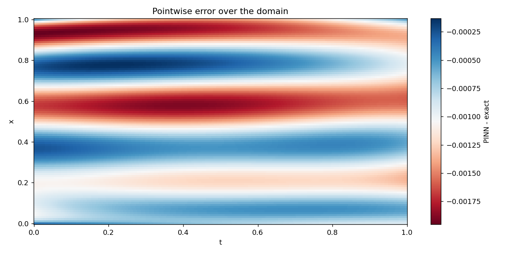

# PDE Solver
Solves the 1D heat equation two ways, using a finite difference method and a physics-informed neural network (PINN), and checks both against the exact solution.

## Problem
The heat equation describes how temperature spreads along a rod over time. The rod starts with a temperature profile of sin(pi * x), and both ends are held at zero. This setup has a known exact solution, which makes it a good way to check whether each solver actually works.

## Finite Difference Solver
The rod is split into a grid of points. To find the temperature at the next moment in time, each point is compared to its two neighbors, and heat flows from hotter points to colder ones. This is repeated over and over to march forward through time. The solver is stable only when the value r = diff_rate * time_step / spacing^2 stays at or below 0.5. The stability file shows what happens above and below this limit.

## PINN
The PINN is a small neural network that takes a position and a time as input and outputs the temperature at that point. Instead of using a grid, it represents the solution as a continuous function. The derivatives needed for the heat equation are found exactly using autograd, and the network is trained to satisfy the equation along with the initial and boundary conditions. It does not use any training data. The equation itself is what the network learns from.

## Results
The PINN matched the exact solution to around 0.0005 RMS error, with a max error of around 0.001. On this simple problem the finite difference solver is actually faster and more accurate. The PINN is included to study the neural approach, which becomes more useful for harder problems like higher dimensions, complex shapes, and inverse problems.





## Files
- `fd_solver.py` solves the heat equation with finite differences
- `fd_stability.py` shows the r <= 0.5 stability limit
- `ODE_pinn.py` a warm-up PINN on Newton's cooling, built to learn the method first
- `heat_pinn.py` the main PINN for the heat equation, checked against the exact solution

## Tech Stack
- Python
- PyTorch
- NumPy
- matplotlib

## How to Run
```bash
git clone https://github.com/KairavT/pde-solver.git
cd pde-solver
python3 -m venv venv
source venv/bin/activate
pip install torch numpy matplotlib
python3 heat_pinn.py
```
